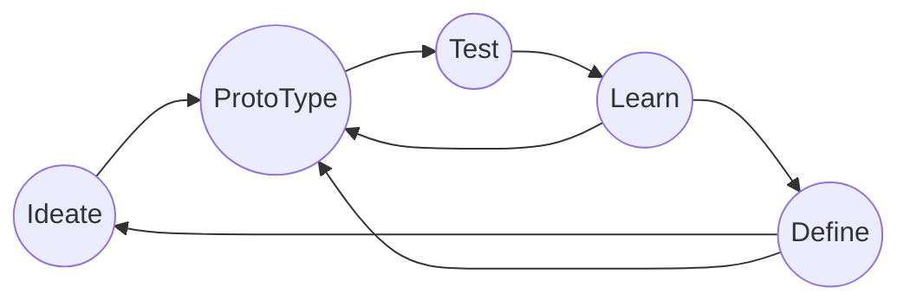

## 原型验证的意义和重要性

- 沟通：需求人员与研发人员、设计人员、测试人员的沟通
- 问题（重）定义：定义问题、或者重新发现和定义问题
- 激发灵感：通过将需求的具像化，激发灵感，细节化需求
- 可用性验证：关注核心可用性sdf
- 关注研发：去除理想化和不适合研发状况的过度需求
- pitching idea：汇报和推销理念和想法

## Prototype working loops

## 不同程度的原型
- sketch
- wireframe
- mockup
- prototype
- production

基于代码的原型工具 Framer
## Visual Programming Tool
Noodl
TouchDesigner

Notch One
VVVV

## 可视化编程工具的优缺
### 优点
- 快速跟踪工作部件，可视化或逻辑化
- 业务、设计和研发人员的共同认知
- 测试过程可视化
- 有助于迭代和实验
- 早期发现设计问题ß
- 成本低

### 缺点
- 不同的学习曲线
- 设计规范化
- 无序化
- 快不一定是好事
- 逻辑拆解能力 

## Beautiful Code: typography and visual programmming - Peter Hilton/

    Programmers spend around 60-70% of their entire programming time on reading code

    - http://arlobelshee.com/good-naming-is-a-process-not-a-single-step/

观点： 可视化程序结构，可以有效的提升代码阅读效率。
灵感：在可视化程序结构上关联bug，可以有效的将历史问题、系统弱点暴露出来。